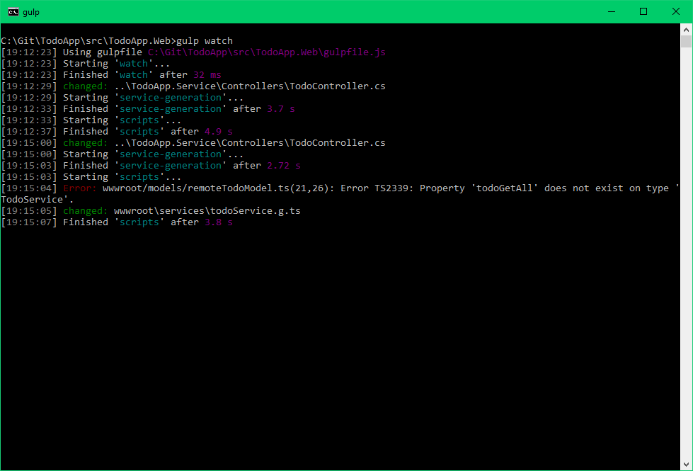
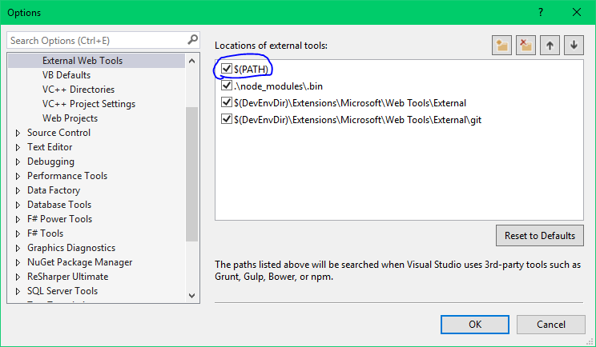

TodoApp
=======

This is the demo code from my presentation *Typing from back to front* on the [Hamburg .NET Usergroup on the 2. March 2016](http://www.meetup.com/Hamburg-C-Net-Meetup/events/227288536/). We have been 41 people in total and it was a great night! Thanks everyone for coming!

About
-----

In my talk I demonstrated an approach on how to use code generation and modern frameworks to leverage typings from the backend in the frontend. A program will read the service backend project, analyze what actions it provides and automatically generate an TypeScript client to access the service, as well as interfaces for every type used in the service. This generation task is automatically issued whenever a file is changed.

Mostly I've worked in web applications with a backend written in C#, and a frontend written in JavaScript or TypeScript. Unfortunately it happened more than once that the backend changed a definition of a service or a data class, and the frontend did not adjust the code accordingly. The crash results at runtime, whenever the code is reached (if it is ever reached during the testing). Other times new service methods or data structures were introduced in the backend, and the frontend was left alone with adding the appropiate interfaces. This is frustrating and time consuming. Unnecessarily, as I think. The solution is easy: Generate that code automatically!

If we just generate the required code automatically we never have to do it manually again. We do not even have to think about it anymore - it just works™. The different definitions will never get out of sync. If it changes in the source, it will also change in the destinaton. With a little bit of work beforehand we will save a lot of time and frustration in the future.

Requirements
------------

This code is using DNX version 1.0.0-rc1-update1 and therefor requires the .NET Version Manager ([DNVM](https://github.com/aspnet/Home/)) which comes pre-installed with Visual Studio 2015. Additionally I'm using Gulp as a task-runner, which requires NodeJS to be installed.

Note that I am using fairly recent JavaScript features (such as the fat-arrow operator) which do not work with the NodeJS version that comes pre-installed with Visual Studio 2015. So if you want to use the Task Runner Explorer in Visual Studio, then you need to instruct Visual Studio to use the locally installed NodeJS version. Unfortunately this is a system setting and can't be configured on a per-solution base. Simply open the options and move the `$(PATH)` entry to the top.

Service and interfaces generation
----------

The actual service and interfaces generation is initiated by the [Gulp task 'service-generation'](blob/src/TodoApp.Web/gulpfile.js#L15). All it does is start the program that is created in the `TodoApp.ServiceGeneration` project. It does not need to be compiled, as this is happening automatically by DNX. The task is also called by the [Gulp watch task](blob/src/TodoApp.Web/gulpfile.js#L36), so the service generation is always automatically called when any file changed.

The generation logic is contained in the [Program.cs](blob/src/TodoApp.ServiceGeneration/Program.cs) and the [ServiceGeneration.cs](blob/src/TodoApp.ServiceGeneration/ServiceGeneration.cs) files.

What I'm doing is essentially:

1. Create a new [in-memory web server](blob/src/TodoApp.ServiceGeneration/Program.cs#L33) by using the [Startup class of the Service project](blob/src/TodoApp.Service/Startup.cs). This way I have the web service started in-memory fully functional.
2. Next I'm retrieving the [IApiDescriptionGroupCollectionProvider](blob/src/TodoApp.ServiceGeneration/Program.cs#L43) from the service provider. This interface was registered [as part of MVC in the service Startup file](blob/src/TodoApp.Service/Startup.cs#L14). It allows us to iterate through all registered actions and controllers. Neat! ASP.NET Web API 2 provides something similiar, named the `IApiExplorer`.
3. Now I [initiate](blob/src/TodoApp.ServiceGeneration/Program.cs#L45) the actual generation code in another class.
4. The [actual generation logic](blob/src/TodoApp.ServiceGeneration/ServiceGeneration.cs#L27) is a bit messy, but it worked for demonstration purpose. It iterates through all api descriptions of the `IApiDescriptionGroupCollectionProvider` and creates an appropiate method for each action. Meanwhile it stores all types it encounters for the following interfaces generation.
5. I [only write the files if they changed](blob/src/TodoApp.ServiceGeneration/Program.cs#L#51), otherwise I cause the [Gulp watch task](blob/src/TodoApp.Web/gulpfile.js#L36) to run even when nothing in the file changed.
6. That's it! Very simply and straight forward, albeit it could be made much cleaner. It does not account for a lot cases, e.g. usage of other system types, but it could easily be extended and adjusted. It requires no further re-compilation (happens automatically).

Existing solutions
------------------

There are plenty of alternative solutions available that can be used as-is. But what I like about my approach is that the generation program is just part of the project. It can easily be debugged and tested. It can be extended with ease. There's no need to check-in or build a project externally and reference it. The generation is part of the solution, it's directly there. It's no hidden project.

Alternative usages
------------------

Generation the service and the data interfaces is just one of many possible use cases. An alternative that I'm thinking of, but not yet create, is to automatically create validation code for the frontend. Plenty of times we validate incoming data on a web service because we need to. We can never, never ever, trust incoming user data to be valid. But very often these validations are so simply that we could also validate the data in the frontend, in the client directly. We would not need to issue a request when it's clear the we require data, and the user did not enter any.

So what do we do? We create validation code in the backend, **and** we create validation code in the frontend. Again, as with the service methods, we define essentially the same in two different locations. Two code places that need to run in sync. Bothersome. But if we can just read the rules that are defined in the backend and automatically generate the frontend code - as much as possible - we avoid this pain again!

Known issues
------------

I did not bother implementing the routing mechanism in the ReactJS TodoApp. The code where I copied the ReactJS Todo App used an older ReactJS version and the routing code did not work anymore.

Questions
---------

Got any question? Feel free to send me a message anywhere. I'm happy to help and answer any question.
